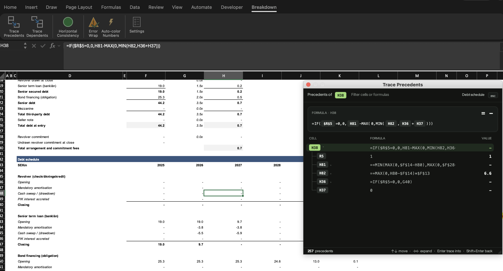

# Breakdown



**Formula tracing and model-auditing for real OGs in Excel, on Mac and Windows.**

Breakdown adds a **Breakdown** tab to Excel's ribbon. The tool contains Trace Precedents, Trace Dependents, Horizontal Consistency, Error Wrap, and Auto-color Numbers in classic financial-modelling fashion.

Just a single file to download and you're good to go!!!

**[⬇ Download Breakdown.xlam](https://github.com/ludvighojman/Breakdown/releases/latest/download/Breakdown.xlam)** · then follow the [install steps](#install) for [Mac](#install-on-mac) or [Windows](#install-on-windows).

<!-- Screenshot of the trace window goes here -->

## How Breakdown makes your life easier

| Button | What it does |
|---|---|
| **Trace Precedents** | Lists every cell that feeds the active cell, as a tree across sheets and several levels deep, with each cell's formula and value. |
| **Trace Dependents** | The same, for every cell that depends on the active cell. |
| **Horizontal Consistency** | Marks each formula on the sheet green or red, depending on whether it matches the formula next to it. |
| **Error Wrap** | Wraps the selected formulas in `IFERROR`. |
| **Auto-color Numbers** | Colours the selection by the financial-modelling convention: blue inputs, black formulas, green links to other sheets, red external links and errors. |
| **Settings** | Change the colours Auto-color Numbers uses, the Error Wrap fallback value, how deep traces go, and the trace window's theme. |

## Install

You need Excel for **Mac** (Microsoft 365 or Excel 2016 and later) or Excel for **Windows** (Microsoft 365 or Excel 2010 and later). 

Since Excel on phones and the web can't run add-ins like this, I can't help you there. People doing serious Excel work on the web have more problems than this, so it should be fine ;)

Breakdown saves some settings (the colours and the Error Wrap value) inside the add-in file, so keep the file in the add-ins folder below rather than in Downloads.

### Install on Mac

1. [Download `Breakdown.xlam`](https://github.com/ludvighojman/Breakdown/releases/latest/download/Breakdown.xlam) and quit Excel.
2. In Finder, press **Cmd+Shift+G** and go to:
   `~/Library/Group Containers/UBF8T346G9.Office/User Content/Add-Ins`
3. Move `Breakdown.xlam` into that folder.
4. Open Excel and choose **Tools → Excel Add-ins…**.
5. Click **Browse…**, select `Breakdown.xlam`, and click **Open**.
6. Make sure **Breakdown** is ticked, then click **OK**.
7. When Excel asks whether to enable macros, choose **Enable Macros**.

The **Breakdown** tab appears in the ribbon, and Excel loads it every time it starts.

### Install on Windows

1. [Download `Breakdown.xlam`](https://github.com/ludvighojman/Breakdown/releases/latest/download/Breakdown.xlam).
2. **Unblock the file. You have to do this, or Excel won't load Breakdown.** Right-click `Breakdown.xlam` → **Properties** → at the bottom of the **General** tab, tick **Unblock** → **OK**.
   Windows marks every downloaded file as coming from the internet, and Excel won't run an add-in marked that way. Don't double-click `Breakdown.xlam` to open it either: add it through the steps below.
3. Move `Breakdown.xlam` to `%APPDATA%\Microsoft\AddIns`. You can paste that path into the File Explorer address bar.
4. Open Excel and choose **File → Options → Add-ins**.
5. At the bottom, set **Manage** to **Excel Add-ins** and click **Go…**.
6. Click **Browse…**, select `Breakdown.xlam`, and click **OK**.
7. Make sure **Breakdown** is ticked, then click **OK**.

The **Breakdown** tab appears in the ribbon, and Excel loads it every time it starts.

### Update

1. Quit Excel.
2. Download the new `Breakdown.xlam` and replace the old one in the add-ins folder. On Windows, **Unblock** it first.
3. Start Excel.

Updating resets the Auto-color Numbers colours and the Error Wrap value to their defaults. Trace settings are kept.

### Uninstall

Open the add-ins dialog (**Tools → Excel Add-ins…** on Mac, **File → Options → Add-ins → Go…** on Windows), untick **Breakdown**, click **OK**, and delete the file.

## Is it safe?

Breakdown is a macro add-in, so Excel asks before running it. Answer: Yes!

- Breakdown doesn't connect to the internet, and it collects no data.
- The only files it writes, apart from saving its own settings, are a few tiny images of the trace window's rounded corners, in Excel's temp folder.
- It only changes cells when you ask it to: Error Wrap rewrites the selected formulas, Auto-color Numbers changes font colours, and Horizontal Consistency adds fill marks that it removes again on the second click.
- All of its code is in this repository, in [`src/`](src), for anyone to read.

## Using Breakdown

### Trace Precedents and Trace Dependents

Select a cell and click **Trace Precedents** (or **Trace Dependents**). A window opens in the top-right corner of Excel:

- **Formula card** at the top: a formula with every cell reference drawn as a chip, and its value. When you select a row, the card shows the formula that links it into the tree, with that reference highlighted.
  - In Trace Precedents, this is the formula that uses the cell. Select F13 under G82 and you see G82's formula with `F13` highlighted.
  - In Trace Dependents, it's the selected cell's own formula.
- **Tree** below the card: the related cells, each with its formula and value.
  - Cells on the same sheet show just their address (`F98`). Cells on other sheets and in other workbooks are named in full.
  - In Trace Precedents, every reference in a formula gets its own row, in the order it's written, so the arrow keys step through each chip in the formula card. A cell used twice is listed twice, and every row with precedents can be expanded to show them.
  - In Trace Dependents, each cell appears once, where it first turns up in the tree, with its own dependents under it.


| Key | Action |
|---|---|
| Up / Down | Move through the list (Excel follows to the cell) |
| Right / Left | Expand or collapse a cell |
| Enter | Open a new trace on the selected cell, to follow the chain one level deeper |
| Shift+Enter | Go back to the trace you came from, with the same rows open |
| Esc | Clear the filter, or close the window |

Clicking a row also takes Excel to that cell, and clicking the arrow next to a cell expands or collapses it. Drag the dots in the bottom-right corner to resize the window; the next trace window opens at the same size.

The trace window comes in a dark and a light theme. Choose one in **Settings → Formula Tracing**; it applies to the next trace window you open.

### Horizontal Consistency

Click it on a sheet to mark every formula by comparing it with the formula to its right, in the way Excel sees formulas copied across a row. Green lines mean the formula matches its neighbour; red lines mean it doesn't. One odd formula shows as two red cells: itself, and the cell to its left.

Click again to remove the marks and restore the original fills. Each sheet is marked and cleared separately.

### Error Wrap

Select cells and click **Error Wrap** to wrap each formula as `=IFERROR(…, "n.a.")`. Cells without a formula are skipped. To use a different fallback, such as `NA()` or `0`, change it in **Settings → Error**.

### Auto-color Numbers

Select a range and click **Auto-color Numbers**. It changes the font colour of every cell with content:

| Cell | Colour |
|---|---|
| Hard-coded inputs, such as historical data and assumptions | Blue `#0000FF` |
| Formulas on the same sheet | Black |
| Formulas that use other sheets | Green `#008000` |
| Links to other workbooks, external data (`WEBSERVICE`), and errors other than `#N/A` | Red `#FF0000` |

Text, dates, hyperlinks and blank cells are left as they are. You can change the colours in **Settings → Auto-Color**.

### Keyboard shortcuts (Windows)

Press **Alt** to show the ribbon's shortcut letters, then:

- **Alt, T** opens the Breakdown tab
- **Alt, T, P** runs Trace Precedents
- **Alt, T, D** runs Trace Dependents

### Keyboard shortcuts (Mac)

IMPORTANT - for this to work on Mac you need to enable KeyTips in settings. Go to Preferences > Accessibility > KeyTips (enable). There you also choose what button should work for launching the shortcuts. My recommendation is to pick Option (Opt), since Cmd on Mac is often mapped to many other shortcuts.

Press **Opt** to show the ribbon's shortcut letters, then:

- **Opt, T** opens the Breakdown tab
- **Opt, T, P** runs Trace Precedents
- **Opt, T, D** runs Trace Dependents

## Troubleshooting

**The Breakdown tab doesn't appear.**
Check that **Breakdown** is ticked in the add-ins dialog. On Windows, check that the file was **Unblocked**; if it wasn't, untick Breakdown, quit Excel, unblock the file, and tick it again. On Mac, check that macros aren't disabled under **Excel → Preferences → Security**.

**Excel says "This file type isn't supported in Protected View" or "Can't access the file" (Windows).**
The file wasn't unblocked, or it was opened by double-clicking it. Quit Excel completely, unblock the file (step 2 of [Install on Windows](#install-on-windows)), start Excel again and add Breakdown through **File → Options → Add-ins**.

**Settings aren't saved.**
Make sure `Breakdown.xlam` is in the add-ins folder from the install steps, not in Downloads or another read-only location.

**Something else went wrong.**
If a button fails, Breakdown shows the error in a message. Please [open an issue](https://github.com/ludvighojman/Breakdown/issues) with that message, your Excel version, and whether you're on Mac or Windows.

## For developers

The add-in is built from plain-text VBA in this repository:

- `src/`: the VBA source (modules, class modules, forms, ribbon XML).
- `dist/Breakdown.xlam`: the built add-in, rebuilt from `src/` and committed with every change.
- `tools/xlam/`: the Node tool that builds it.

```sh
cd tools/xlam
npm install
npm run build    # writes dist/Breakdown.xlam from src/
npm run check    # verifies dist/Breakdown.xlam matches src/ (also runs in CI)
npm test         # tests for the build tool itself
```

The build writes the VBA as source only, so Excel compiles it when it loads the file. That is what lets one file run on both Mac and Windows. Form layouts are taken from the existing `dist/Breakdown.xlam`. Deleting a module, class or form file from `src/` removes it on the next build; adding a new one still has to be done once in Excel's VBA editor.

Keep the VBA Mac-compatible: put Windows API `Declare` statements inside `#If Mac Then … #Else … #End If` with a Mac fallback, and don't use Windows-only COM objects such as `VBScript.RegExp` or `Scripting.Dictionary`. [CLAUDE.md](CLAUDE.md) has the full list of rules.

To publish a release, push a version tag such as `v1.0.0`. The [release workflow](.github/workflows/release.yml) checks the build and attaches `Breakdown.xlam` to a GitHub Release, which the download links above always point to.

## Credits and licence

Breakdown is based on [XLerate](https://github.com/omegarhovega/XLerate) by omegarhovega. It is released under the [MIT License](LICENSE).
